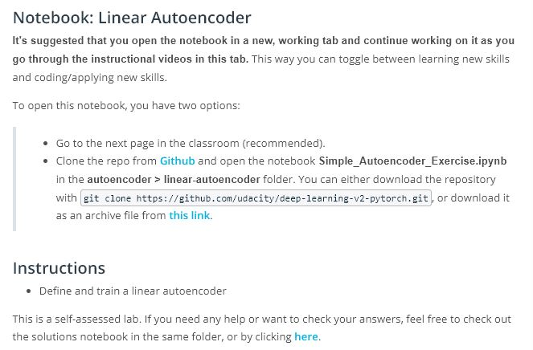
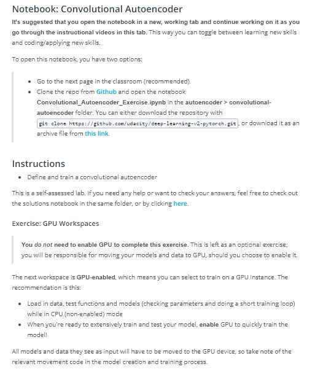

# Lesson 5: AutoEncoders

## Concepts
1. [Autoencoders](https://www.youtube.com/watch?v=a5zHMWOq0fc&feature=emb_logo)
1. [A Linear Autoencoder](https://www.youtube.com/watch?v=KbmfyDNxL5U&feature=emb_logo)
1. Pre-Notebook: Linear Autoencoder

1. [Defining & Training an Autoencoder](https://www.youtube.com/watch?v=OWrlQUSGqyo&feature=emb_logo)
1. [A Simple Solution](https://www.youtube.com/watch?v=Jh3mbomqpw8&feature=emb_logo)
1. [Learnable Upsampling](https://www.youtube.com/watch?v=KjztLwPksj8&feature=emb_logo)
1. [Transpose Convolutions](https://www.youtube.com/watch?v=hnnLAC1Q0zg&feature=emb_logo)
1. [Convolutional Autoencoder](https://www.youtube.com/watch?v=QCA8QeZeDW8&feature=emb_logo)
1. Pre-Notebook: Convolutional Autoencoder

1. [Convolutional Solution](https://www.youtube.com/watch?v=2_Yw9LLomCo&feature=emb_logo)
	> You may notice that I am not using model.train() or eval() here, and that is because none of the layers in this model will change behavior between these modes. So, you could use these modes, but it is not necessary. Evaluation mode affects dropout layers that change dynamically during training, whereas our typical convolutional and maxpooling layers will behave as their weights dictate!
1. [Upsampling & Denoising](https://www.youtube.com/watch?v=XX63da4EPN0&feature=emb_logo)
	> Upsampling, Alternative Solution
	> Feel free to check out the solutions notebook in the previous workspace or in your Github repository's convolutional-autoencoder folder. You can also view it directly by clicking here.
1. [De-noising](https://www.youtube.com/watch?v=RIfEhKev24I&feature=emb_logo)
1. Pre-Notebook: De-noising Autoencoder
