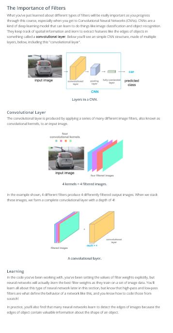

# Lesson 1: CNN

## Concepts
1. [Introduction](https://www.youtube.com/watch?v=38ExGpdyvJI&feature=emb_logo)
1. [Applications of CNNs](https://www.youtube.com/watch?v=HrYNL_1SV2Y&feature=emb_logo)
```
Optional Resources
Read about the [WaveNet](https://deepmind.com/blog/wavenet-generative-model-raw-audio/) model.

Why train an A.I. to talk, when you can train it to sing ;)? In April 2017, researchers used a variant of the WaveNet model to generate songs. The original paper and demo can be found [here](http://www.creativeai.net/posts/W2C3baXvf2yJSLbY6/a-neural-parametric-singing-synthesizer).
Learn about CNNs for [text classification](http://www.wildml.com/2015/12/implementing-a-cnn-for-text-classification-in-tensorflow/).

You might like to sign up for the author's Deep Learning [Newsletter](https://www.getrevue.co/profile/wildml)!
Read about Facebook's [novel CNN approach](https://code.facebook.com/posts/1978007565818999/a-novel-approach-to-neural-machine-translation/) for language translation that achieves state-of-the-art accuracy at nine times the speed of RNN models.

Play [Atari games](https://deepmind.com/research/dqn/) with a CNN and reinforcement learning. You can [download](https://sites.google.com/a/deepmind.com/dqn/) the code that comes with this paper.

If you would like to play around with some beginner code (for deep reinforcement learning), you're encouraged to check out Andrej Karpathy's [post](http://karpathy.github.io/2016/05/31/rl/).
Play [pictionary](https://quickdraw.withgoogle.com/#) with a CNN!

Also check out all of the other cool implementations on the [A.I. Experiments](https://aiexperiments.withgoogle.com/) website. Be sure not to miss [AutoDraw](https://www.autodraw.com/)!
Read more about [AlphaGo](https://deepmind.com/research/alphago/).

Check out this [article](https://www.technologyreview.com/s/604273/finding-solace-in-defeat-by-artificial-intelligence/?set=604287), which asks the question: If mastering Go “requires human intuition,” what is it like to have a piece of one’s humanity challenged?
Check out these really cool videos with drones that are powered by CNNs.

Here's an interview with a startup - [Intelligent Flying Machines (IFM)](https://www.youtube.com/watch?v=AMDiR61f86Y).
Outdoor autonomous navigation is typically accomplished through the use of the [global positioning system (GPS)](http://www.droneomega.com/gps-drone-navigation-works/), but here's a demo with a CNN-powered [autonomous drone](https://www.youtube.com/watch?v=wSFYOw4VIYY).
If you're excited about using CNNs in self-driving cars, you're encouraged to check out:

our Self-Driving Car Engineer Nanodegree, where we classify signs in the [German Traffic Sign dataset](http://benchmark.ini.rub.de/?section=gtsrb&subsection=dataset) in this [project](https://github.com/udacity/CarND-Traffic-Sign-Classifier-Project).
our Machine Learning Engineer Nanodegree, where we classify house numbers from the [Street View House Numbers dataset](http://ufldl.stanford.edu/housenumbers/) in this [project](https://github.com/udacity/machine-learning/tree/master/projects/digit_recognition).
this [series of blog posts](https://pythonprogramming.net/game-frames-open-cv-python-plays-gta-v/) that details how to train a CNN in Python to produce a self-driving A.I. to play Grand Theft Auto V.
Check out some additional applications not mentioned in the video.

Some of the world's most famous paintings have been [turned into 3D](http://www.businessinsider.com/3d-printed-works-of-art-for-the-blind-2016-1) for the visually impaired. Although the article does not mention how this was done, we note that it is possible to use a CNN to [predict depth](https://www.cs.nyu.edu/~deigen/depth/) from a single image.
Check out [this research](https://research.googleblog.com/2017/03/assisting-pathologists-in-detecting.html) that uses CNNs to localize breast cancer.
CNNs are used to [save endangered species](https://blogs.nvidia.com/blog/2016/11/04/saving-endangered-species/?adbsc=social_20170303_70517416)!
An app called [FaceApp](http://www.digitaltrends.com/photography/faceapp-neural-net-image-editing/) uses a CNN to make you smile in a picture or change genders.
```
1. [Lesson Outline](https://www.youtube.com/watch?v=77LzWE1qQrc&feature=emb_logo)

1. [MNIST Dataset](https://www.youtube.com/watch?v=a7bvIGZpcnk&feature=emb_logo)
	> The MNIST database is arguably the most famous database in the field of deep learning! Check out [this figure](https://www.kaggle.com/benhamner/popular-datasets-over-time) that shows datasets referenced over time in [NIPS](https://nips.cc/) papers.
1. [How Computers Interpret Images](https://www.youtube.com/watch?v=mEPfoM68Fx4&feature=emb_logo)
```
Normalizing image inputs
Data normalization is an important pre-processing step. It ensures that each input (each pixel value, in this case) comes from a standard distribution. That is, the range of pixel values in one input image are the same as the range in another image. This standardization makes our model train and reach a minimum error, faster!

Data normalization is typically done by subtracting the mean (the average of all pixel values) from each pixel, and then dividing the result by the standard deviation of all the pixel values. Sometimes you'll see an approximation here, where we use a mean and standard deviation of 0.5 to center the pixel values. [Read more about the Normalize transformation in PyTorch](https://pytorch.org/docs/stable/torchvision/transforms.html#transforms-on-torch-tensor).

The distribution of such data should resemble a [Gaussian function](http://mathworld.wolfram.com/GaussianFunction.html) centered at zero. For image inputs we need the pixel numbers to be positive, so we often choose to scale the data in a normalized range [0,1].
```
1. [MLP Structure & Class Scores](https://www.youtube.com/watch?v=fP0Odiai8sk&feature=emb_logo)
1. [Do Your Research](https://www.youtube.com/watch?v=CR4JeAn1fgk&feature=emb_logo)
1. [Loss & Optimization](https://www.youtube.com/watch?v=BmPDtSXv18w&feature=emb_logo)
1. [Defining a Network in PyTorch](https://www.youtube.com/watch?time_continue=2&v=9gvaQvyfLfY&feature=emb_logo)

1. [Training the Network](https://www.youtube.com/watch?time_continue=1&v=904bfqibcCw&feature=emb_logo)

1. Pre-Notebook: MLP Classification, Exercise

1. [One Solution](https://www.youtube.com/watch?v=7q37WPjQhDA&feature=emb_logo)

Check out the [first research paper](https://www.cs.toronto.edu/~hinton/absps/JMLRdropout.pdf) to propose dropout as a technique for overfitting.
If you'd like more information on activation functions, check out this [website](http://cs231n.github.io/neural-networks-1/#actfun).
1. [Model Validation](https://www.youtube.com/watch?v=b5934VsV3SA&feature=emb_logo)
1. [Validation Loss](https://www.youtube.com/watch?v=uGPP_-pbBsc&feature=emb_logo)

1. [Image Classification Steps](https://www.youtube.com/watch?v=UHFBnitKraA&feature=emb_logo)
1. [MLPs vs CNNs](https://www.youtube.com/watch?v=Q7CR3cCOtJQ&feature=emb_logo)
Check out the performance of [other classifiers](http://yann.lecun.com/exdb/mnist/).
1. [Local Connectivity](https://www.youtube.com/watch?v=z9wiDg0w-Dc&feature=emb_logo)
1. [Filters and the Convolutional Layer](https://www.youtube.com/watch?v=x_dhnhUzFNo&feature=emb_logo)
1. [Filters & Edges](https://www.youtube.com/watch?v=hfqNqcEU6uI&feature=emb_logo)
```
Filters
To detect changes in intensity in an image, you’ll be using and creating specific image filters that look at groups of pixels and react to alternating patterns of dark/light pixels. These filters produce an output that shows edges of objects and differing textures.

So, let’s take a closer look at these filters and see when they’re useful in processing images and identifying traits of interest.
```
1. Frequency in Images


1. [High-pass Filters](https://www.youtube.com/watch?v=OpcFn_H2V-Q&feature=emb_logo)

1. Quiz: Kernels

1. OpenCV & Creating Custom Filters

1. Convolutional Layer

1. [Convolutional Layers (Part 2)](https://www.youtube.com/watch?v=RnM1D-XI--8&feature=emb_logo)
```
The Jupyter notebook described in the video can be accessed from the deep-learning-v2-pytorch GitHub respository linked [here](https://github.com/udacity/deep-learning-v2-pytorch/tree/master/convolutional-neural-networks). Navigate to the conv-visualization/ folder and open conv_visualization.ipynb.

Optional Resource
Check out [this website](http://setosa.io/ev/image-kernels/), which allows you to create your own filter. You can then use your webcam as input to a convolutional layer and visualize the corresponding activation map!
```
1. [Stride and Padding](https://www.youtube.com/watch?v=GmStpNi8jBI&feature=emb_logo)
1. [Pooling Layers](https://www.youtube.com/watch?v=_Ok5xZwOtrk&feature=emb_logo)

1. Capsule Networks


Resources
You can learn more about capsules, in this [blog post](https://cezannec.github.io/Capsule_Networks/).
And experiment with an implementation of a capsule network in PyTorch, at this [github repo](https://github.com/cezannec/capsule_net_pytorch).
Supporting Materials
[Dynamic routing between capsules, hinton et al](https://video.udacity-data.com/topher/2018/November/5bfdca4f_dynamic-routing/dynamic-routing.pdf)
1. [Increasing Depth](https://www.youtube.com/watch?v=YKif1KNpWeE&feature=emb_logo)
1. [CNNs for Image Classification](https://www.youtube.com/watch?v=smaw5GqRaoY&feature=emb_logo)


[Read more about Conv2d in the](https://pytorch.org/docs/stable/nn.html#conv2d) documentation.
Pooling Layers
Maxpooling layers commonly come after convolutional layers to shrink the x-y dimensions of an input, read more about pooling layers in PyTorch, [here](https://pytorch.org/docs/stable/nn.html#maxpool2d).
1. Convolutional Layers in PyTorch


1. [Feature Vector](https://www.youtube.com/watch?v=g6QuiVno8zI&feature=emb_logo)
1. Pre-Notebook: CNN Classification

1. [CIFAR Classification Example](https://www.youtube.com/watch?v=FF_EmZ2sf2w&feature=emb_logo)
```
model.eval()
There is an omission in the above code: including model.eval() !

model.eval() will set all the layers in your model to evaluation mode. This affects layers like dropout layers that turn "off" nodes during training with some probability, but should allow every node to be "on" for evaluation. So, you should set your model to evaluation mode before testing or validating your model and set it to model.train() (training mode) only during the training loop.

This is reflected in the following notebook code and in our [Github repository](https://github.com/udacity/deep-learning-v2-pytorch/tree/master/convolutional-neural-networks/cifar-cnn).
```
1. [CNNs in PyTorch](https://www.youtube.com/watch?v=GNxzWfiz3do&feature=emb_logo)
Check out the CIFAR-10 Competition's winning [architecture](http://blog.kaggle.com/2015/01/02/cifar-10-competition-winners-interviews-with-dr-ben-graham-phil-culliton-zygmunt-zajac/)!
1. [Image Augmentation](https://www.youtube.com/watch?v=zQnx2jZmjTA&feature=emb_logo)
1. [Augmentation Using Transformations](https://www.youtube.com/watch?v=J_gjHVt9pVw&feature=emb_logo)
You can take a look at the complete augmentation code in the previous notebook directory, or, directly in the Github [repository](https://github.com/udacity/deep-learning-v2-pytorch/blob/master/convolutional-neural-networks/cifar-cnn/cifar10_cnn_augmentation.ipynb)
1. [Groundbreaking CNN Architectures](https://www.youtube.com/watch?v=GdYOqihgb2k&feature=emb_logo)
Optional Resources
Check out the [AlexNet](Optional Resources
Check out the AlexNet paper!
Read more about VGGNet here.
The ResNet paper can be found here.
Here's the Keras documentation for accessing some famous CNN architectures.
Read this detailed treatment of the vanishing gradients problem.
Here's a GitHub repository containing benchmarks for different CNN architectures.
Visit the ImageNet Large Scale Visual Recognition Competition (ILSVRC) website.) paper!
Read more about [VGGNet](https://arxiv.org/pdf/1409.1556.pdf) here.
The [ResNet](https://arxiv.org/pdf/1512.03385v1.pdf) paper can be found here.
Here's the Keras [documentation](https://keras.io/applications/) for accessing some famous CNN architectures.
Read this [detailed treatment](http://neuralnetworksanddeeplearning.com/chap5.html) of the vanishing gradients problem.
Here's a [GitHub repository](https://github.com/jcjohnson/cnn-benchmarks) containing benchmarks for different CNN architectures.
Visit the [ImageNet Large Scale Visual Recognition Competition (ILSVRC)](http://www.image-net.org/challenges/LSVRC/) website.
1. [Visualizing CNNs (Part 1)](https://www.youtube.com/watch?v=mnqS_EhEZVg&feature=emb_logo)
(REALLY COOL) Optional Resources
If you would like to know more about interpreting CNNs and convolutional layers in particular, you are encouraged to check out these resources:
Here's a [section](http://cs231n.github.io/understanding-cnn/) from the Stanford's CS231n course on visualizing what CNNs learn.
Check out this [demonstration](https://aiexperiments.withgoogle.com/what-neural-nets-see) of a cool [OpenFrameworks](http://openframeworks.cc/) app that visualizes CNNs in real-time, from user-supplied video!
Here's a [demonstration](https://www.youtube.com/watch?v=AgkfIQ4IGaM&t=78s) of another visualization tool for CNNs. If you'd like to learn more about how these visualizations are made, check out this [video](https://www.youtube.com/watch?v=ghEmQSxT6tw&t=5s).
Read this [Keras blog post](https://blog.keras.io/how-convolutional-neural-networks-see-the-world.html) on visualizing how CNNs see the world. In this post, you can find an accessible introduction to Deep Dreams, along with code for writing your own deep dreams in Keras. When you've read that:
Also check out this [music video](https://www.youtube.com/watch?v=XatXy6ZhKZw) that makes use of Deep Dreams (look at 3:15-3:40)!
Create your own Deep Dreams (without writing any code!) using this [website](https://deepdreamgenerator.com/).
If you'd like to read more about interpretability of CNNs:
Here's an [article](https://blog.openai.com/adversarial-example-research/) that details some dangers from using deep learning models (that are not yet interpretable) in real-world applications.
There's a lot of active research in this area. [These authors](https://arxiv.org/abs/1611.03530) recently made a step in the right direction.
1. Visualizing CNNs (Part 2)
The CNN we will look at is trained on ImageNet as described in [this paper](http://www.matthewzeiler.com/pubs/arxive2013/eccv2014.pdf) by Zeiler and Fergus. In the images below (from the same paper), we’ll see what each layer in this network detects and see how each layer detects more and more complex ideas.
1. [Summary of CNNs](https://www.youtube.com/watch?v=Te9QCvhx6N8&feature=emb_logo)