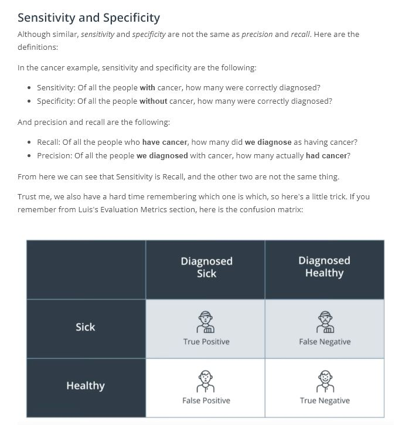

# Lesson 8: DL for Cancer Detection

## Concepts
1. [Intro](https://www.youtube.com/watch?v=ZCpXvVdIdnY&feature=emb_logo)
1. [Skin Cancer](https://www.youtube.com/watch?v=70jGZeiTNgk&feature=emb_logo)

1. [Survival Probability of Skin Cancer](https://www.youtube.com/watch?v=QPlp3NeGuSk&feature=emb_logo)
1. [Medical Classification](https://www.youtube.com/watch?v=RCOSP60dV7U&feature=emb_logo)
1. [The data](https://www.youtube.com/watch?v=2RLbbV7MQNA&feature=emb_logo)
1. [Image Challenges](https://www.youtube.com/watch?v=Efnoj1KNPHw&feature=emb_logo)

1. [Quiz: Data Challenges](https://www.youtube.com/watch?v=F8yc7BlV93c&feature=emb_logo)

1. [Solution: Data Challenges](https://www.youtube.com/watch?v=1z3o4niQuNg&feature=emb_logo)
1. [Training the Neural Network](https://www.youtube.com/watch?v=HwiI-UXUx-M&feature=emb_logo)
1. [Quiz: Random vs Pre-initialized Weights](https://www.youtube.com/watch?v=DRC1e4XGl2M&feature=emb_logo)

1. [Solution: Random vs Pre-initialized Weight]https://www.youtube.com/watch?v=sOuoRZRKDzs&feature=emb_logo)
1. [Validating the Training](https://www.youtube.com/watch?v=Oxm9ofvov3I&feature=emb_logo)
1. [Quiz: Sensitivity and Specificity]https://www.youtube.com/watch?v=O17MnhWBmKA&feature=emb_logo)

For the following quiz, you'll need to Google the definitions of sensitivity and specificity. If you'd like a refresher on precision and recall, here is [one resource](https://en.wikipedia.org/wiki/Precision_and_recall).
1. [Solution: Sensitivity and Specificity](https://www.youtube.com/watch?v=GBZjyeMjKxc&feature=emb_logo)
1. More on Sensitivity and Specificity

1. [Quiz: Diagnosing Cancer](https://www.youtube.com/watch?v=4UzkwecBJro&feature=emb_logo)

1. [Solution: Diagnosing Cancer](https://www.youtube.com/watch?v=IJYvt2ssUFk&feature=emb_logo)

1. [Refresh on ROC Curves](https://www.youtube.com/watch?v=2Iw5TiGzJI4&feature=emb_logo)
[Images](https://www.youtube.com/watch?time_continue=1&v=1GdiN5Wc8LA&feature=emb_logo)

1. [Quiz: ROC Curve](https://www.youtube.com/watch?v=Xv3v59_CfEU&feature=emb_logo)

1. [Solution: ROC Curve](https://www.youtube.com/watch?v=sdUUf6RRmXI&feature=emb_logo)
1. [Comparing our Results with Doctors](https://www.youtube.com/watch?v=fWwe_JlpnlQ&feature=emb_logo)
1. [Visualization](https://www.youtube.com/watch?v=aGIGB4Ta3_A&feature=emb_logo)
1. [What is the network looking at?](https://www.youtube.com/watch?v=qN-rvoxPbBw&feature=emb_logo)
1. [Refresh on Confusion Matrices](https://www.youtube.com/watch?v=9GLNjmMUB_4&feature=emb_logo)

1. [Confusion Matrix](https://www.youtube.com/watch?v=3rpN-YYlfes&feature=emb_logo)
1. [Conclusion](https://www.youtube.com/watch?v=WhpE_8sTt-0&feature=emb_logo)
1. Useful Resources
Here's our publication in [Nature](https://www.nature.com/articles/nature21056.epdf?author_access_token=8oxIcYWf5UNrNpHsUHd2StRgN0jAjWel9jnR3ZoTv0NXpMHRAJy8Qn10ys2O4tuPakXos4UhQAFZ750CsBNMMsISFHIKinKDMKjShCpHIlYPYUHhNzkn6pSnOCt0Ftf6).
Other articles about our work:
[Fortune Magazine](http://fortune.com/2017/01/26/stanford-ai-skin-cancer/)
[Bloomberg](https://www.bloomberg.com/news/articles/2017-06-29/diagnosing-skin-cancer-with-google-images)
[BBC](http://www.bbc.com/news/health-38717928)
[Wall Street Journal](https://www.wsj.com/articles/computers-turn-medical-sleuths-and-identify-skin-cancer-1486740634?emailToken=JRrzcPt+aXiegNA9bcw301gwc7UFEfTMWk7NKjXPN0TNv3XR5Pmlyrgph8DyqGWjAEd26tYY7mAuACbSgWwvV8aXkLNl1A74KycC8smailE=)
[Forbes](https://www.forbes.com/sites/forbestechcouncil/2017/09/27/what-can-computer-vision-do-in-the-palm-of-your-hand/#4d2c686847a7)
[Scientific American](https://www.scientificamerican.com/article/deep-learning-networks-rival-human-vision1/)
1. [Mini Project Introduction](https://www.youtube.com/watch?v=Rgf3YVFWl-M&feature=emb_logo)
1. Mini Project: Dermatologist AI

