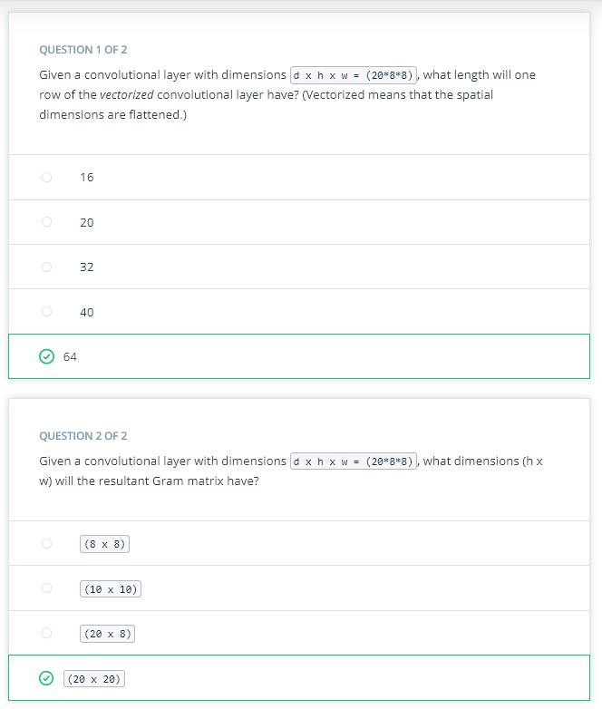
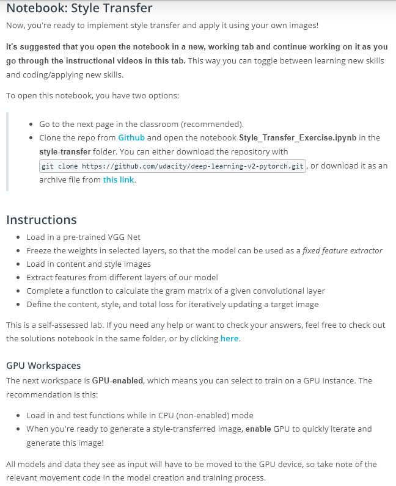

# Lesson 6: Style Transfer

## Concepts
1. [Style Transfer](https://www.youtube.com/watch?v=_urN9BQ7RHM&feature=emb_logo)
1. [Separating Style & Content](https://www.youtube.com/watch?v=PNFFAhymuHc&feature=emb_logo)
1. [VGG19 & Content Loss](https://www.youtube.com/watch?v=PQ1UuzOIjCM&feature=emb_logo)
Resources:
[Image Style Transfer Using Convolutional Neural Networks](https://www.cv-foundation.org/openaccess/content_cvpr_2016/papers/Gatys_Image_Style_Transfer_CVPR_2016_paper.pdf)
1. [Gram Matrix](https://www.youtube.com/watch?v=e718uVAW3KU&feature=emb_logo)

1. [Style Loss](https://www.youtube.com/watch?v=VazrQ7u-OHo&feature=emb_logo)
1. [Loss Weights](https://www.youtube.com/watch?v=qO8oiZBtG1I&feature=emb_logo)
1. [VGG Features](https://www.youtube.com/watch?v=Q5N2NEv7ADc&feature=emb_logo)
1. Pre-Notebook: Style Transfer

1. [Features & Gram Matrix](https://www.youtube.com/watch?v=f89x9oAh6X0&feature=emb_logo)
1. [Gram Matrix Solution](https://www.youtube.com/watch?time_continue=15&v=uncCKMI5Yns&feature=emb_logo)
1. [Defining the Loss](https://www.youtube.com/watch?v=lix8d3B2QcE&feature=emb_logo)
1. [Total Loss & Complete Solution](https://www.youtube.com/watch?v=DzaQm9awcwY&feature=emb_logo)