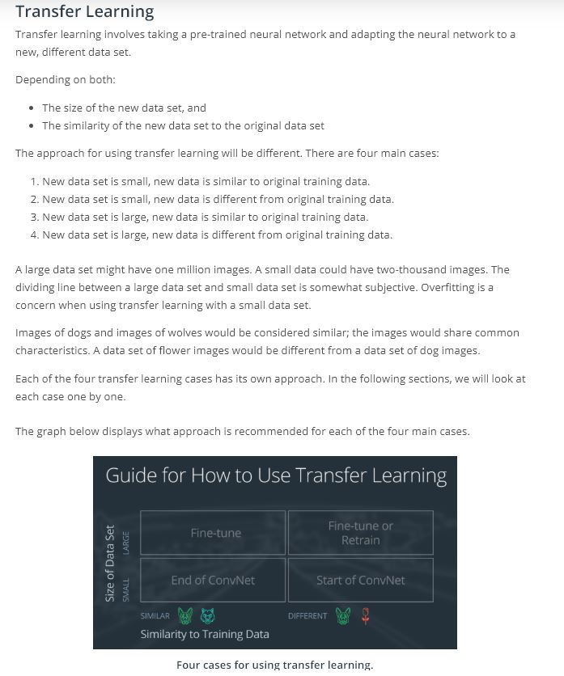
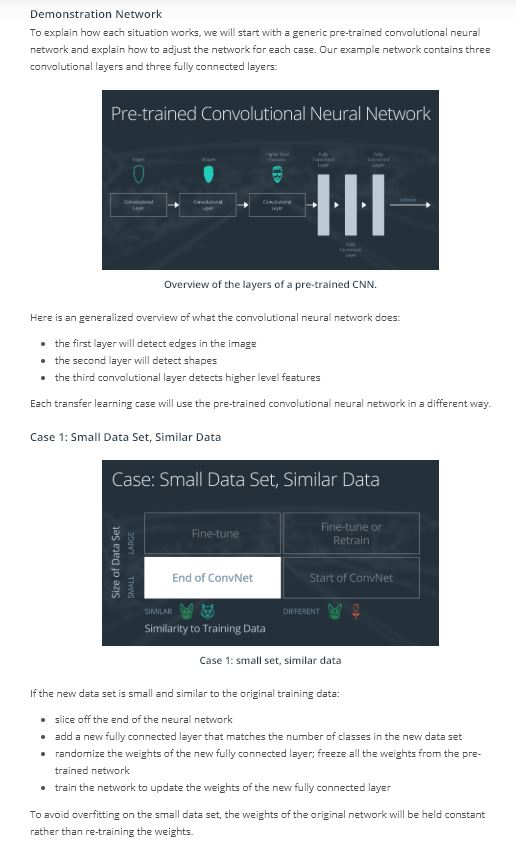
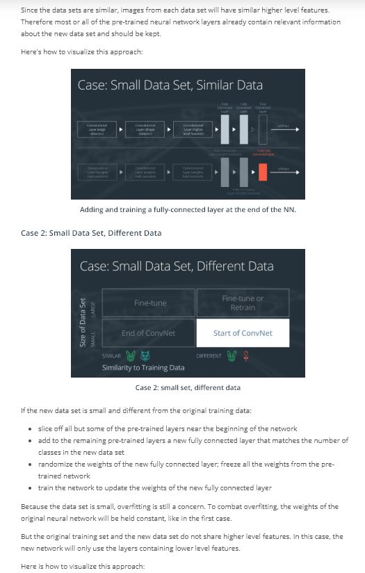
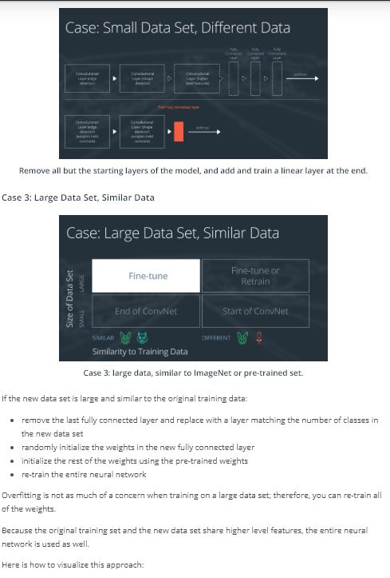
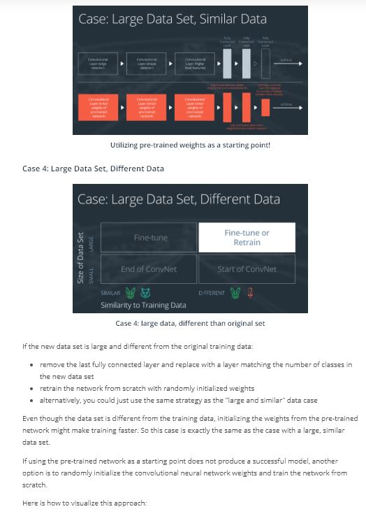
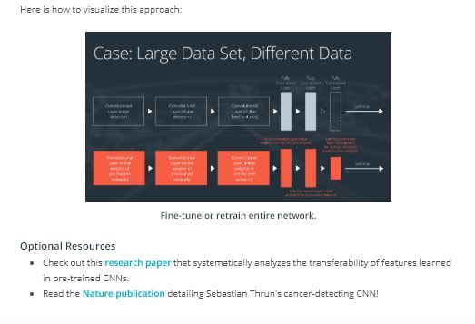
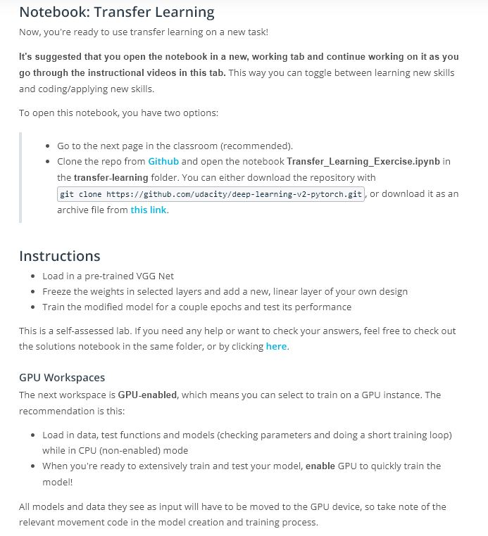

# Lesson 3: Transfer Learning

## Concepts
1. [Transfer Learning](https://www.youtube.com/watch?v=yfPEROi3SPU&feature=emb_logo)
1. [Useful Layers](https://www.youtube.com/watch?v=kn4BN7z3UGQ&feature=emb_logo)
1. [Fine-Tuning](https://www.youtube.com/watch?v=XOyb315xYbw&feature=emb_logo)






Check out this [research paper](https://arxiv.org/pdf/1411.1792.pdf) that systematically analyzes the transferability of features learned in pre-trained CNNs.
Read the [Nature publication](http://www.nature.com/articles/nature21056.epdf?referrer_access_token=_snzJ5POVSgpHutcNN4lEtRgN0jAjWel9jnR3ZoTv0NXpMHRAJy8Qn10ys2O4tuP9jVts1q2g1KBbk3Pd3AelZ36FalmvJLxw1ypYW0UxU7iShiMp86DmQ5Sh3wOBhXDm9idRXzicpVoBBhnUsXHzVUdYCPiVV0Slqf-Q25Ntb1SX_HAv3aFVSRgPbogozIHYQE3zSkyIghcAppAjrIkw1HtSwMvZ1PXrt6fVYXt-dvwXKEtdCN8qEHg0vbfl4_m&tracking_referrer=edition.cnn.com) detailing Sebastian Thrun's cancer-detecting CNN!
1. [VGG Model & Classifier](https://www.youtube.com/watch?v=fOiQFXItYe4&feature=emb_logo)
1. Pre-Notebook: Transfer Learning

1. [Freezing Weights & Last Layer](https://www.youtube.com/watch?v=ssNIX_2QfMQ&feature=emb_logo)
```
Freezing parameters
To freeze any parameters, you can use the variable requires_grad. By default this is set to True. To freeze existing parameters you can loop through each one and set param.requires_grad = False.

Above, there is a small typo, which leaves out the s in requires_grad. This has been fixed in the exercise notebooks and our Github repo.
```
1. [Training a Classifier](https://www.youtube.com/watch?v=4LniBMFI53g&feature=emb_logo)