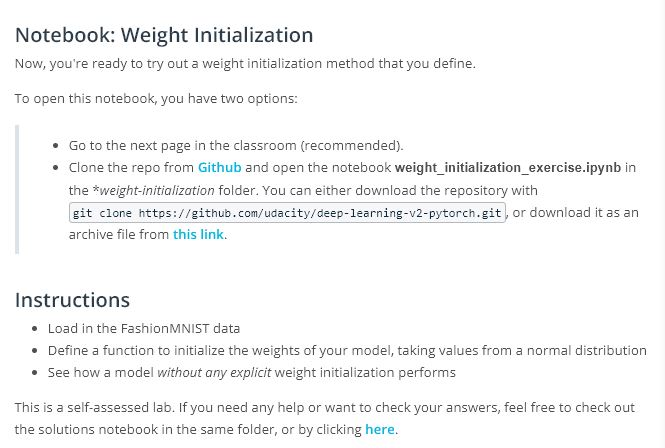

# Lesson 4: Weight Init

## Concepts
1. [Weight Initialization](https://www.youtube.com/watch?v=Ehc60si91Wg&feature=emb_logo)
1. [Constant Weights](https://www.youtube.com/watch?v=zR4fECgeZ7Y&feature=emb_logo)
1. [Random Uniform](https://www.youtube.com/watch?v=FacdIomrLIw&feature=emb_logo)
1. [General Rule](https://www.youtube.com/watch?v=YKe9iOUMmsI&feature=emb_logo)
1. [Normal Distribution](https://www.youtube.com/watch?v=xm43q4qD2tI&feature=emb_logo)
1. Pre-Notebook: Weight Initialization, Normal Distribution

1. [Solution and Default Initialization](https://www.youtube.com/watch?v=xIn8XLbR1LM&feature=emb_logo)
1. Additional Material
Additional Material
New techniques for dealing with weights are discovered every few years. We've provided the most popular papers in this field over the years.
[Understanding the difficulty of training deep feedforward neural networks](http://jmlr.org/proceedings/papers/v9/glorot10a/glorot10a.pdf)
[Delving Deep into Rectifiers: Surpassing Human-Level Performance on ImageNet Classification](https://arxiv.org/pdf/1502.01852v1.pdf)
[Batch Normalization: Accelerating Deep Network Training by Reducing Internal Covariate Shif]https://arxiv.org/pdf/1502.03167v2.pdf)