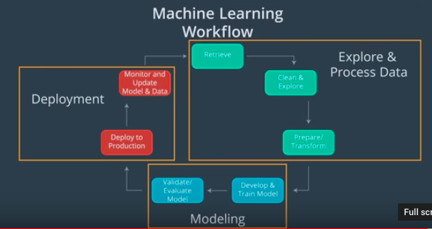

# Lesson 1: Introduction to Deployment

## Concepts

1. [Welcome](https://www.youtube.com/watch?v=jQ2IZzga8Nw)
1. What's Ahead?
1. [Problem Introduction](https://www.youtube.com/watch?time_continue=19&v=-ZtVV7RvGYY)
1. [Machine Learning Workflow](https://www.youtube.com/watch?time_continue=2&v=ku_96X6TZas)

	
	> Amazon Web Services (AWS) discusses their definition of the [Machine Learning Workflow](https://docs.aws.amazon.com/sagemaker/latest/dg/how-it-works-mlconcepts.html).
	>  Google Cloud Platform (GCP) discusses their definition of the [Machine Learning Workflow](https://cloud.google.com/ml-engine/docs/tensorflow/ml-solutions-overview).
	>  Microsoft Azure (Azure) discusses their definition of the [Machine Learning Workflow](https://docs.microsoft.com/en-us/azure/machine-learning/service/overview-what-is-azure-ml).
1. [Quiz-Machine Learning Workflow](images/quiz1.png)
