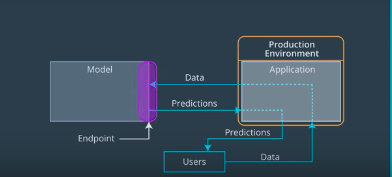
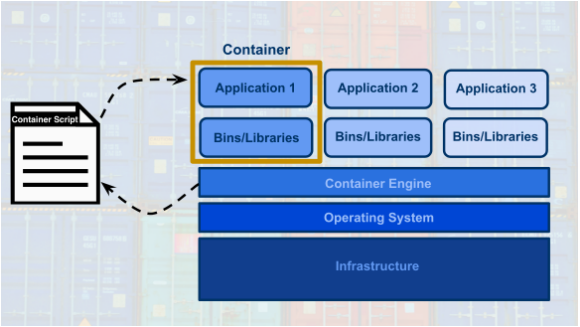

# Lesson 1: Introduction to Deployment

## Concepts

1. [Welcome](https://www.youtube.com/watch?v=jQ2IZzga8Nw)
1. What's Ahead?
1. [Problem Introduction](https://www.youtube.com/watch?time_continue=19&v=-ZtVV7RvGYY)
1. [Machine Learning Workflow](https://www.youtube.com/watch?time_continue=2&v=ku_96X6TZas)
	
	* Amazon Web Services (AWS) discusses their definition of the [Machine Learning Workflow](https://docs.aws.amazon.com/sagemaker/latest/dg/how-it-works-mlconcepts.html).
	* Google Cloud Platform (GCP) discusses their definition of the [Machine Learning Workflow](https://cloud.google.com/ml-engine/docs/tensorflow/ml-solutions-overview).
	* Microsoft Azure (Azure) discusses their definition of the [Machine Learning Workflow](https://docs.microsoft.com/en-us/azure/machine-learning/service/overview-what-is-azure-ml).
1. [Quiz-Machine Learning Workflow](images/quiz1.png)
1. What is Cloud Computing & Why Would We Use It?
	> Cloud computing can simply be thought of as transforming an Information Technology (IT) product into a service. With our vacation photos example, we transformed storing photos on an IT product, the flash drive; into storing them using a service, like Google Drive.
	* Benefits
	> 1. Reduced Investments and Proportional Costs (providing cost reduction)
	> 1. Increased Scalability (providing simplified capacity planning)
	> 1. Increased Availability and Reliability (providing organizational agility)
	* Risks
	> 1. (Potential) Increase in Security Vulnerabilities 
	> 1. Reduced Operational Governance Control (over cloud resources)
	> 1. Limited Portability Between Cloud Providers
	> 1. Multi-regional Compliance and Legal Issues
	* Ref
	> National Institute of Standards and Technology formal definition of [Cloud Computing](https://csrc.nist.gov/publications/detail/sp/800-145/final).
	> Kavis, M. (2014). Architecting the Cloud: Design Decisions for Cloud Computing Service Models. Hoboken, NJ: Wiley. Chapter 3 provides the worst practices of cloud computing which highlights both risks and benefits of cloud computing. Chapter 9 provides the security responsibilities by service model.
	> Amazon Web Services (AWS) discusses their definition of [Cloud Computing](https://aws.amazon.com/what-is-cloud-computing/).
	> Google Cloud Platform (GCP) discusses their definition of [Cloud Computing](https://cloud.google.com/what-is-cloud-computing/).
	> Microsoft Azure (Azure) discusses their definition of [Cloud Computing](https://azure.microsoft.com/en-us/overview/what-is-cloud-computing/).
1. Why Cloud Computing? [Quiz2](images/quiz2.png) [Quiz3](images/quiz3.png)
1. [Machine Learning Applications](https://www.youtube.com/watch?time_continue=25&v=Q4rgQo6ofoc)
1. Paths to Deployment
	1. Python model is recoded into the programming language of the production environment.
 	1. Model is coded in Predictive Model Markup Language (PMML) or Portable Format Analytics (PFA).
 	1. Python model is converted into a format that can be used in the production environment. The third method that's most similar to what’s used for deployment within Amazon’s SageMaker.
1. Paths to Deployment [Quiz](images/quiz4.png)
1. [Production Environments](https://www.youtube.com/watch?time_continue=19&v=BH23Me3bbF4)  
	
1. Production Environment [Quiz](images/quiz5.png)
1. Endpoints & REST APIs [figure](images/endpoint.png)
	> Communication between the application and the model is done through the endpoint (interface), where the endpoint is an Application Programming Interface (API).
	> An easy way to think of an API, is as a set of rules that enable programs, here the application and the model, to communicate with each other.
	> In this case, our API uses a REpresentational State Transfer, REST, architecture that provides a framework for the set of rules and constraints that must be adhered to for communication between programs.
	> This REST API is one that uses HTTP requests and responses to enable communication between the application and the model through the endpoint (interface).
	* Application's responsibilty:
	> To format the user’s data in a way that can be easily put into the HTTP request message and used by the model.
	> To translate the predictions from the HTTP response message in a way that’s easy for the application user’s to understand.
1. Endpoints & REST APIs [Quiz1](images/quiz6.png) [Quiz2](images/quiz7.png)
1. Containers
	> Both the model and the application require a computing environment so that they can be run and available for use. One way to create and maintain these computing environments is through the use of containers.
	> A container can be thought of as a standardized collection/bundle of software that is to be used for the specific purpose of running an application.
	> A common container software is Docker. Due to its popularity sometimes Docker is used synonymously with containers.
	> Can contain all types of different software.
	> The structure of a Docker container enables the container to be created, saved, used, and deleted through a set of common tools.
	> The common tool set works with any container regardless of the software the container contains.
	> This container script is simply the instructions (algorithm) that is used to create a container; for Docker these container scripts are referred to as dockerfiles.
	> This is shown with the image below, where the container engine uses a container script to create a container for an application to run within. These container script files can be stored in repositories, which provide a simple means to share and replicate containers. For Docker, the [Docker Hub](https://hub.docker.com/explore/) is the official repository for storing and sharing dockerfiles. Here's an example of a [dockerfile](https://github.com/pytorch/pytorch/blob/master/docker/pytorch/Dockerfile) that creates a docker container with Python 3.6 and PyTorch installed.
		

