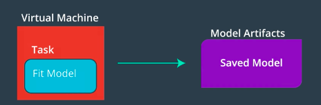
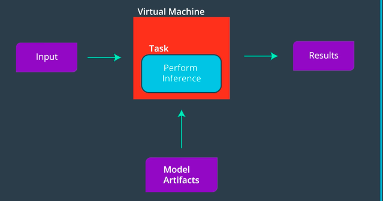

# Lesson 2: Building a Model using SageMaker

## Concepts

1. [Introduction to Amazon SageMaker](https://www.youtube.com/watch?v=nJCc4_9-iAQ)
	> 1. Notebook: explore and process data
	> 1. Apllication Programming Interface: simplifies modeling and deployment steps.It is collection of tools for training process and inference process.

	
	
1. Create an AWS Account
1. Apply AWS Credits
	> In your AWS account, your AWS Account ID can be found under 'My Account', which is itself found in the dropdown under the name of your account, between the bell and the 'Global' dropdown.
1. Check for GPU Access
1. [Setting up a Notebook Instance](https://www.youtube.com/watch?v=TRUCNy5Eqjc)
	> S3 stands for Simple Storage Service. It is Amazon's data storage service.
	> Also, using ml.t2.medium should be all that is necessary for the notebooks that you will encounter in this module. In addition, an ml.t2.medium instance is covered under the free tier.
1. [Getting the Notebooks](https://www.youtube.com/watch?v=jqL74whe9yo)
	```
	cd SageMaker
	git clone https://github.com/udacity/sagemaker-deployment.git
	exit
	```
1. Is Everything Set Up?
1. [Boston Housing Example: Getting the data Ready](https://www.youtube.com/watch?v=78y5cTR-JxM)
	> Session - A session is a special object that allows you to do things like manage data in S3 and create and train any machine learning models; you can read more about the functions that can be called on a session, at this documentation. The upload_data function should be close to the top of the list! You'll also see functions like train, tune, and create_model all of which we'll go over in more detail, later.

	> Role - Sometimes called the execution role, this is the IAM role that you created when you created your notebook instance. The role basically defines how data that your notebook uses/creates will be stored. You can even try printing out the role with print(role) to see the details of this creation.

	> In addition, we will be using a random tree model. In particular, we will be using the [XGBoost algorithm](https://xgboost.readthedocs.io/en/latest/)
	[XGBoost paper](https://s3.amazonaws.com/video.udacity-data.com/topher/2018/November/5bfdf09f_xgboost/xgboost.pdf)

	> Batch Transform is the method we will be using to test our model once we have trained it. 
	> High Level describes the API we will be using to get SageMaker to perform various machine learning tasks. In particular, it refers to the Python SDK whose documentation can be found here: https://sagemaker.readthedocs.io/en/latest/. This high level approach simplifies a lot of the details when working with SageMaker and can be very useful.
1. [Boston Housing Example - Training the Model](https://www.youtube.com/watch?v=rqYlkCTLmIY)
	> You can read the documentation on [estimators](https://sagemaker.readthedocs.io/en/latest/estimators.html) for more information about this object. Essentially, the Estimator is an object that specifies some details about how a model will be trained. It gives you the ability to create and deploy a model.
	> There's a list of [winning XGBoost-based solutions](https://github.com/dmlc/xgboost/tree/master/demo#machine-learning-challenge-winning-solutions) to a variety of competitions, at the linked XGBoost repository.
	> A training job is used to train a specific estimator.

	> When you request a training job to be executed you need to provide a few items:

		* A location on S3 where your training (and possibly validation) data is stored,
		* A location on S3 where the resulting model will be stored (this data is called the model artifacts),
		* A location of a docker container (certainly this is the case if using a built in algorithm) to be used for training
		* A description of the compute instance that should be used.


	> You can see a high-level (which we've just walked through) example of training a KMeans estimator, in this [documentation](https://docs.aws.amazon.com/sagemaker/latest/dg/ex1-train-model-create-training-job.html). This high-level example defines a KMeans estimator, and uses .fit() to train that model. Later, we'll show you a low-level model, in which you have to specify many more details about the training job.
1. [Boston Housing Example - Testing the Model](https://www.youtube.com/watch?time_continue=8&v=CZRKuS_qYtg)
	> You can read more about the transform and wait functions, in the [transformer documentation](https://sagemaker.readthedocs.io/en/latest/transformer.html). In this case, the transformer is used to create a transform job and evaluate a trained model. The transform function takes in the location of some test data, and some information about how that test data is formatted.
1. [Mini-Project: Building Your First Model](https://www.youtube.com/watch?time_continue=4&v=ouLvRqMMbbY)
	> If you look at the [deployment Gitub](https://github.com/udacity/sagemaker-deployment) repository, inside of the Mini-Projects folder is a notebook called IMDB Sentiment Analysis - XGBoost (Batch Transform).ipynb. Inside of the notebook are some tasks for you to complete.
1. [Mini-Project: Solution](https://www.youtube.com/watch?v=utUxiW-tZrY)
1. [Boston Housing In-Depth - Data Preparation](https://www.youtube.com/watch?v=TA-Ms7djeL0)
	> In the previous notebooks we looked at, we use the Python SDK to interact with SageMaker, calling this the high-level approach. Now we will look at the low level approach where we describe different tasks we want SageMaker to perform. The documentation for the low level approach can be found in the [Amazon SageMaker Developer Guide](https://docs.aws.amazon.com/sagemaker/latest/dg/whatis.html)

	> You will notice as we go through the details that describing the different tasks we want SageMaker to do can be quite involved. However there is a reason to understand it!

	> The high level approach makes developing new models very straightforward, requiring very little code. The reason this can be done is that certain decisions have been made for you. The low level approach allows you to be far more particular in how you want the various tasks executed, which is good for when you want to do something a little more complicated.
1. [Boston Housing In-Depth - Creating a Training Job](https://www.youtube.com/watch?time_continue=4&v=1CIbWNUSZXo)
1. [Boston Housing In-Depth - Building a Model](https://www.youtube.com/watch?time_continue=28&v=JJyVsmcV2M4)
1. [Boston Housing In-Depth - Creating a Batch Transform Job](https://www.youtube.com/watch?time_continue=32&v=JwPJMYRl3nw)
1. Summary