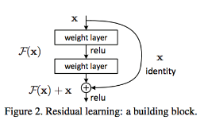

# Lesson 4: Implementing a CycleGAN

## Concepts

1. [CycleGAN Notebook & Data](https://www.youtube.com/watch?v=pVBu1aL8evA)
1. Pre-Notebook: CycleGAN
	> cycle-gan>CycleGAN_Exercise.ipynb
1. Notebook: CycleGAN
1. [DC Discriminator](https://www.youtube.com/watch?time_continue=12&v=93kh2l6C7Bw)
1. [DC Discriminator, Solution](https://www.youtube.com/watch?time_continue=14&v=XaxOFzOpves)
1. [Generator & Residual Blocks](https://www.youtube.com/watch?v=AYIq7cUjLMs)
	> Residual Blocks
	> So far, we've mostly been defining networks as layers that are connected, one-by-one, in sequence, but there are a few other types of connections we can make! The connection that residual blocks make is sometimes called a skip connection. By summing up the output of one layer with the input of a previous layer, we are effectively making a connection between layers that are not in sequence; we are skipping over at least one layer with such a connection, as is indicated by the loop arrow below.
	
	If you'd like to learn more about residual blocks and especially their effect on ResNet image classification models, I suggest reading this [blog post](https://towardsdatascience.com/an-overview-of-resnet-and-its-variants-5281e2f56035), which details how ResNet (and its variants) work!
	> Skip Connections
	More generally, skip connections can be made between several layers to combine the inputs of, say, a much earlier layer and a later layer. These connections have been shown to be especially important in image segmentation tasks, in which you need to preserve spatial information over time (even when your input has gone through strided convolutional or pooling layers). One such example, is in this [paper](https://arxiv.org/abs/1608.04117) on skip connections and their role in medical image segmentation.
1. [CycleGAN Generator](https://www.youtube.com/watch?time_continue=20&v=StfeBXCuaOI)
1. [Blocks & Generator, Solution](https://www.youtube.com/watch?time_continue=18&v=IPKbiwLIcvA)
1. [Adversarial & Cycle Consistency Losses](https://www.youtube.com/watch?v=-OO9pb8EyJI)
	> LSGANs
	> Least squares can partly address the vanishing gradient problem for training deep GANs. The problem is as follows: for negative log-likelihood loss, when an input x is quite big, the gradient can get close to zero and become meaningless for training purposes. However, with a squared loss term, the gradient will actually increase with a larger x, as shown [LSGAN paper](https://arxiv.org/abs/1611.04076).
	> Least square loss is just one variant of a GAN loss. There are many more variants such as a [Wasserstein GAN loss](https://arxiv.org/abs/1701.07875) and others. These loss variants sometimes can help stabilize training and produce better results. As you write your own code, you're encouraged to hypothesize, try out different loss functions, and see which works best in your case!
1. [Loss & Optimization, Solution](https://www.youtube.com/watch?time_continue=20&v=0H86-nQ3qSE)
1. [Training Exercise](https://www.youtube.com/watch?time_continue=50&v=F5_tK9lo9y0)
	> Spinning up a GPU Instance
	> If you are interested in training this model on multiple GPUs and over a long period of time, I suggest you look back at the Cloud Computing lesson in the Convolutional Neural Networks section of this program. There you will find instructions on spinning up a GPU instance using AWS cloud services. Also, all students, enrolled in the complete program have access to free AWS GPU hrs and can redeem them using the instructions in that lesson.
	> In general, if you want to train your networks for a long time on GPU, spinning up an instance on a cloud provider is a good thing to do. It is also a useful skill to have!
1. [Training Solution & Generated Samples](https://www.youtube.com/watch?time_continue=5&v=Cl3oSLG9dpA)
	> Image Synthesis
	> Digital image transformation (say from summer to winter transformation) is still the domain of highly-skilled programmers and special-effects artists. However, with technology like trained GANs, image transformation and creation could become a tool for any photographer! As in this example, GANs can be trained to produce realistic images on a vast scale, and it will be interesting to see how image synthesis evolves as an art form and in machine learning.

