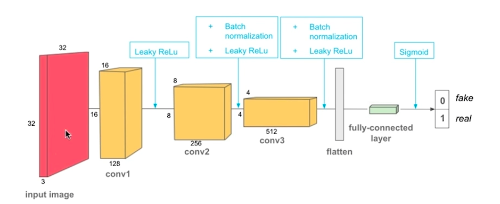
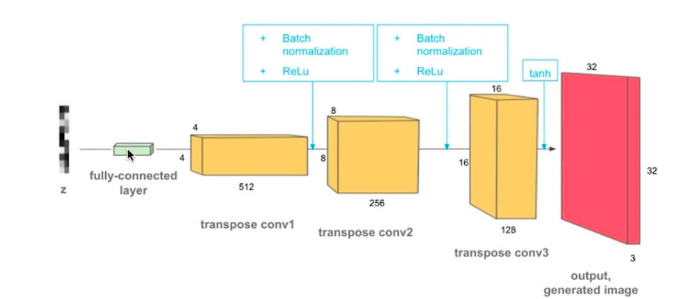

# Lesson 2: Deep Convolutional Generative Adversarial Networks

## Concepts

1. [Deep Convolutional GAN](https://www.youtube.com/watch?time_continue=13&v=s_ZdpYxPayM)
	> Street View House Number (SVHN) Dataset
1. [DCGAN, Discriminator](https://www.youtube.com/watch?time_continue=23&v=5qVHECEB6H0)
	>DCGAN paper, [Unsupervised Representational Learning with Deep Convolutional Generative Adversarial Networks](https://arxiv.org/pdf/1511.06434.pdf)
	> Downsampling is done with stride=2, no max pooling
	> all hidden layers have BN and leaky-relu
	> Final convolution layer is flattened and coonected to a single sigmoid unit
1. [DCGAN Generator](https://www.youtube.com/watch?time_continue=3&v=2Nhg5VxbAdo)
	> upsampling is done with transpose convolution
	> First connect the z vector with a FC layer, then  perform tanspose convolution to make it 4x3x512 shape
	> hidden layer has relu and BN
	> tanh in output layer
1. What is Batch Normalization?[Original paper](https://arxiv.org/pdf/1502.03167.pdf) Deep Learning Book [Chapter 8](http://www.deeplearningbook.org/contents/optimization.html)
	
1. Pre-Notebook: Batch Norm
	> batch-norm/Batch_Normalization.ipynb
1. Notebook: Batch Norm
1. Benefits of Batch Normalization
	1. You add batch normalization to layers inside the__init__ function.
	1. Layers with batch normalization do not include a bias term. So, for linear or convolutional layers, you'll need to set bias=False if you plan to add batch normalization on the outputs.
	1. You can use PyTorch's [BatchNorm1d] function to handle the math on linear outputs or [BatchNorm2d] for 2D outputs, like filtered images from convolutional layers.
	1. You add the batch normalization layer before calling the activation function, so it always goes layer > batch norm > activation.
	> Networks train faster 
	> Allows higher learning rates 
	> Makes weights easier to initialize
	> Makes more activation functions viable 
	> Simplifies the creation of deeper networks 
	> Provides a bit of regularization
	> May give better results overall 
1. [DCGAN Notebook & Data](https://www.youtube.com/watch?time_continue=12&v=4_OnTTDSFPo)
1. Notebook: DCGAN, SVHN
	> dcgan-svhn/DCGAN_Exercise.ipynb
1. Notebook: DCGAN, SVHN
1. [Scaling, Solution](https://www.youtube.com/watch?v=Aqru1dIMLzU)
	> method1:x=x*(max-min)+min
	> method2:x=2*x-1
1. [Discriminator](https://www.youtube.com/watch?time_continue=8&v=bBE-f30JT5I)
	> Why no bias?
	> The reason there is no bias for our convolutional layers is because we have batch normalization applied to their outputs. The goal of batch normalization is to get outputs with:
		> mean = 0
		> standard deviation = 1
	>Since we want the mean to be 0, we do not want to add an offset (bias) that will deviate from 0. We want the outputs of our convolutional layer to rely only on the coefficient weights.
1. [Discriminator, Solution](https://www.youtube.com/watch?v=D3E0BDwb2pY)
	
	1. [Summary](http://cs231n.github.io/convolutional-networks/)
	* Accepts a volume of size W1×H1×D1
	* Requires four hyperparameters:
		* Number of filters K,
		* their spatial extent F,
		* the stride S,
		* the amount of zero padding P.
	* Produces a volume of size W2×H2×D2 where:
		* W2=(W1−F+2P)/S+1
		* H2=(H1−F+2P)/S+1 (i.e. width and height are computed equally by symmetry)
		* D2=K
	* With parameter sharing, it introduces F⋅F⋅D1 weights per filter, for a total of (F⋅F⋅D1)⋅K weights and K biases.
1. [Generator](https://www.youtube.com/watch?time_continue=2&v=zRajfkO-J7s)
	
1. [Generator, Solution](https://www.youtube.com/watch?v=cznaE5TlKEo)
1. [Optimization Strategy](https://www.youtube.com/watch?v=US0HjU0alv4)
	> Evaluation mode is important when you have batchnorm and dropout layers
1. [Optimization Solution & Samples](https://www.youtube.com/watch?v=mJyeXSClnmw)
	1. GANs for Illuminating Model Weaknesses
	GANs are not only used for image generation, they are also used to find weaknesses in existing, trained models. The adversarial examples that a generator learns to make, can be designed to trick a pre-trained model. Essentially, small perturbations in images can cause a classifier (like AlexNet or a known image classifier) to fail pretty spectacularly!
	[This OpenAI blog post](https://blog.openai.com/adversarial-example-research/) details how adversarial examples can be used to "attack" existing models, and discusses potential security issues. And one example of a perturbation that causes misclassification can be seen below
1. Other Applications of GANs
	1. [Semi-Supervised Learning](https://www.youtube.com/watch?time_continue=2&v=_LRpHPxZaX0)
		> Semi-Supervised Learning in PyTorch
There is a readable implementation of a semi-supervised GAN in this [Github repository](https://github.com/Sleepychord/ImprovedGAN-pytorch). If you'd like to implement this in code, I suggest reading through that code!
	1. Domain Invariance
		> The researchers then had to find a way to combine what they learned from these multiple sources! They did this with the use of multiple classifiers; adversarial networks that do not include a Generator, just two classifiers.

One classifier is learning to recognize car types
And another is learning to classify whether a car image came from Google Streetview or cars.com, given the extracted features from that image
So, the first classier’s job is to classify the car image correctly and to trick the second classifier so that the second classifier cannot tell whether the extracted image features indicate an image from the Streetview or cars.com domain!

The idea is: if the second classifier cannot tell which domain the features are from, then this indicates that these features are shared among the two domains, and you’ve found features that are domain-invariant.

Domain-invariance can be applied to a number of applications in which you want to find features that are invariant between two different domains. These can be image domains or domains based on different population demographics and so on. This is also sometimes referred to as [adversarial feature learning](https://arxiv.org/pdf/1705.11122.pdf).
	1. Ethical and Artistic Applications: Further Reading
		* [Ethical implications of GANs](https://www.newyorker.com/magazine/2018/11/12/in-the-age-of-ai-is-seeing-still-believing) and when "fake" images can give us information about reality.
		* [Do Androids Dream in Balenciaga?](https://www.ssense.com/en-us/editorial/fashion/do-androids-dream-of-balenciaga-ss29) note that the author briefly talks about generative models having artistic potential rather than ethical implications, but the two go hand in hand. The generator, in this case, will recreate what it sees on the fashion runway; typically thin, white bodies that do not represent the diversity of people in the world (or even the diversity of people who buy Balenciaga).