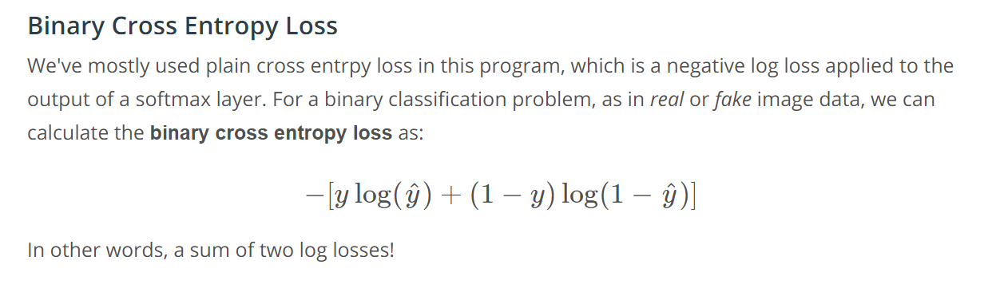
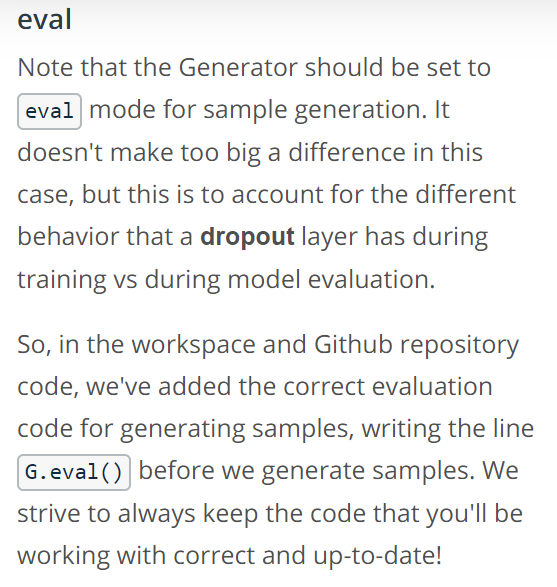

# Lesson 1: Generative Adversarial Networks

## Concepts

1. [Introducing Ian GoodFellow](https://www.youtube.com/watch?time_continue=4&v=0mlT7c_xAoc)
	> GANs are machine learning models that can imagine new things. -Ian Goodfellow
1. [Applications of GANs](https://www.youtube.com/watch?v=dW2puRa-yqo)
	1. STACKGAN-> Generate image from text description.
	1. Pix2Pix-> iGAN-> Sketch to realistic image. Photo to cartoon, blueprint to building.
	1. CycleGAN-> horse to zebra video.
	1. Simulated training set
	1. Imitation Learning
	1. Non-visual application-> high energy particle physics experiments.
1. [How GANs work](https://www.youtube.com/watch?v=MF0QCP1OC9I)
1. [Games and Equilibria](https://www.youtube.com/watch?v=2zi8DOWIVas)
	> Equilbrium occurs when neither player can improve their situation without changing the other player's strategy.
	> Key Research Problem: Designing a learning algorithm for finding the equlibrium of a game involving high dimensional, continuous, non-convex cost function.
1. [Tips for Training GANs](https://www.youtube.com/watch?time_continue=1&v=S9WDdySwcHc)
	> Hidden layer activation function-> lrelu
	> Generator output activation function-> tanh
	> Discriminator output activation function-> sigmoid
	> d_loss=nn.BCEWithLogitsLoss(logits, labels*0.9)
	> g_loss=nn.BCEWithLogitsLoss(logits, flipped_labels)
	> Optimizer-> Adam is a good choice
	> batch normalization in every layer except the output layer of the generator and input layer of the discriminator.
	> apply batch normaliztion on  all the real-date in one mini-batch, then apply batch normaliztion separately on another minbatch containing all the generated samples.
	[Improved training techniques](https://s3.amazonaws.com/video.udacity-data.com/topher/2018/November/5bea0c6a_improved-training-techniques/improved-training-techniques.pdf)
1. [Generating Fake Images](https://www.youtube.com/watch?v=7KI4yITZLBk)
	> GAN examples:
If you'd like to read about even more applications of GANs, I recommend this [Medium article](https://medium.com/@jonathan_hui/gan-some-cool-applications-of-gans-4c9ecca35900) which does an overview of interesting applications!
The tulip generation model was created by the artist Anna Ridler, and you can read about her data collection method and inspiration in [this article](https://www.fastcompany.com/90237233/this-ai-dreams-in-tulips). Also, check out the [full-length video](https://vimeo.com/287645190)!
1. [MNIST GAN](https://www.youtube.com/watch?v=g2CDYdc18Jg)
1. [GAN Notebook & Data](https://www.youtube.com/watch?time_continue=1&v=z7WnnnYyFo4)
1. Pre-Notebook: MNIST GAN
1. [Notebook: MNIST GAN](MNIST_GAN_Exercise.ipynb) [Solution](MNIST_GAN_Exercise.ipynb)
1. [The Complete Model](https://www.youtube.com/watch?time_continue=1&v=_6i1LjuPddg)
	> The universal approximation function
The universal approximation theorem states that a feed-forward network with a single hidden layer is able to approximate certain continuous functions. A few assumptions are made about the functions operating on a subset of real numbers and about the activation function applied to the output of this single layer. But this is very exciting! This theorem is saying that a simple, one-layer neural network can represent a wide variety of interesting functions. You can learn more about the theorem [here](https://en.wikipedia.org/wiki/Universal_approximation_theorem).
1. [Generator & Discriminator](https://www.youtube.com/watch?v=luR_wKhtIG8)
1. [Hyperparameters](https://www.youtube.com/watch?time_continue=9&v=u8ntGzeK9Lw)
1. [Fake and Real Losses](https://www.youtube.com/watch?time_continue=1&v=andSglxiuik)
	
	> You can read the [PyTorch documentation, here](https://pytorch.org/docs/stable/nn.html#bceloss).
1. [Optimization Strategy, Solution](https://www.youtube.com/watch?time_continue=1&v=m5_f084E09A)
1. [Training Two Networks](https://www.youtube.com/watch?time_continue=2&v=pPdyFMnxNkA)
	
1. [Training Solution](https://www.youtube.com/watch?time_continue=8&v=uRNfacJ90bI)

	