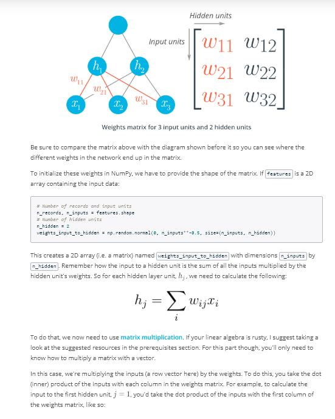

# Lesson 2: Gradient Descent

## Concepts
1. Mean Squared Error Function
	> Log-Loss vs Mean Squared Error
	> In the previous section, Luis taught you about the log-loss function. There are many other error functions used for neural networks. Let me teach you another one, called the mean squared error. As the name says, this one is the mean of the squares of the differences between the predictions and the labels. In the following section I'll go over it in detail, then we'll get to implement backpropagation with it on the same student admissions dataset.
	> And as a bonus, we'll be implementing this in a very effective way using matrix multiplication with NumPy!
1. [Gradient Descent](https://www.youtube.com/watch?v=29PmNG7fuuM&feature=emb_logo)

1. [Gradient Descent: The Math](https://www.youtube.com/watch?v=7sxA5Ap8AWM&feature=emb_logo)
	> Notes
	> Check out Khan Academy's [Multivariable calculus lessons](https://www.khanacademy.org/math/multivariable-calculus) if you are unfamiliar with the subject.
1. Gradient Descent: The Code

1. Implementing Gradient Descent

1. [Multilayer Perceptrons](https://www.youtube.com/watch?v=Rs9petvTBLk&feature=emb_logo)

1. [Backpropagation](https://www.youtube.com/watch?v=MZL97-2joxQ&feature=emb_logo)

1. Implementing backpropagation

1. Further Reading
Further reading
Backpropagation is fundamental to deep learning. TensorFlow and other libraries will perform the backprop for you, but you should really really understand the algorithm. We'll be going over backprop again, but here are some extra resources for you:
* From Andrej Karpathy: [Yes, you should understand backprop](https://medium.com/@karpathy/yes-you-should-understand-backprop-e2f06eab496b#.vt3ax2kg9)
* Also from Andrej Karpathy, [a lecture from Stanford's CS231n course](https://www.youtube.com/watch?v=59Hbtz7XgjM)
