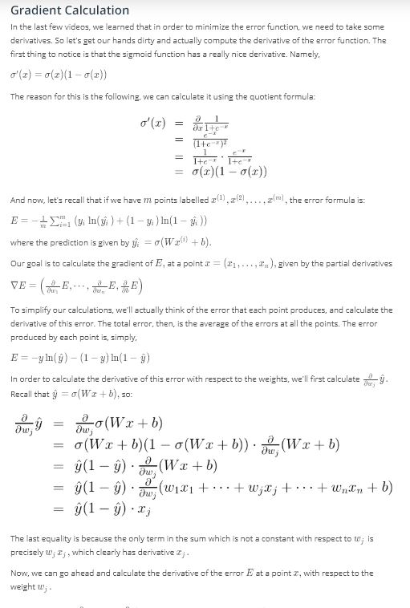

# Lesson 1: Intro to NN

## Concepts
1. Instructor- Luis Serrano
	> Hello and welcome to Introduction to Neural Networks, given by Luis!
	> Luis was formerly a Machine Learning Engineer at Google. He holds a PhD in mathematics from the University of Michigan, and a Postdoctoral Fellowship at the University of Quebec at Montreal.
1. [Introduction](https://www.youtube.com/watch?v=tn-CrUTkCUc&feature=emb_logo)
1. [Classification Problems 1](https://www.youtube.com/watch?v=Dh625piH7Z0&feature=emb_logo)

1. [Classification Problems 2](https://www.youtube.com/watch?v=46PywnGa_cQ&feature=emb_logo)
1. [Linear Boundaries](https://www.youtube.com/watch?v=X-uMlsBi07k&feature=emb_logo)
1. [Higher Dimensions](https://www.youtube.com/watch?v=eBHunImDmWw&feature=emb_logo)

1. [Perceptrons](https://www.youtube.com/watch?v=hImSxZyRiOw&feature=emb_logo)

1. [Why "Neural Networks"?](https://www.youtube.com/watch?v=zAkzOZntK6Y&feature=emb_logo)
1. Perceptrons as Logical Operators
	> Perceptrons as Logical Operators
	> In this lesson, we'll see one of the many great applications of perceptrons. As logical operators! You'll have the chance to create the perceptrons for the most common of these, the AND, OR, and NOT operators. And then, we'll see what to do about the elusive XOR operator. Let's dive in!
	[AND Perceptron](https://www.youtube.com/watch?v=Y-ImuxNpS40&feature=emb_logo)
	[XOR Perceptron](https://www.youtube.com/watch?v=-z9K49fdE3g&feature=emb_logo)
	
	
	
	
	
	
1. [Perceptron Trick](https://www.youtube.com/watch?v=-zhTROHtscQ&feature=emb_logo)
[Split Data](https://www.youtube.com/watch?v=fATmrG2hQzI&feature=emb_logo)
[Math](https://www.youtube.com/watch?v=lif_qPmXvWA&feature=emb_logo)

1. [Perceptron Algorithm](https://www.youtube.com/watch?v=p8Q3yu9YqYk&feature=emb_logo)

1. [Non-Linear Regions](https://www.youtube.com/watch?v=B8UrWnHh1Wc&feature=emb_logo)
1. [Error Functions](https://www.youtube.com/watch?v=YfUUunxWIJw&feature=emb_logo)
1. [Log-loss Error Function](https://www.youtube.com/watch?v=jfKShxGAbok&feature=emb_logo)

1. [Discrete vs Continuous](https://www.youtube.com/watch?v=rdP-RPDFkl0&feature=emb_logo)
[Part 2](https://www.youtube.com/watch?v=Rm2KxFaPiJg&feature=emb_logo)

1. [Softmax](https://www.youtube.com/watch?v=NNoezNnAMTY&feature=emb_logo)
[Part 2](https://www.youtube.com/watch?v=RC_A9Tu99y4&feature=emb_logo)
[Part 3](https://www.youtube.com/watch?v=n8S-v_LCTms&feature=emb_logo)

1. [One-Hot Encoding](https://www.youtube.com/watch?v=AePvjhyvsBo&feature=emb_logo)
1. [Maximum Likelihood](https://www.youtube.com/watch?v=1yJx-QtlvNI&feature=emb_logo)
[Probabilty](https://www.youtube.com/watch?v=6nUUeQ9AeUA&feature=emb_logo)

1. [Maximizing Probabilities](https://www.youtube.com/watch?v=-xxrisIvD0E&feature=emb_logo)
[Part 2](https://www.youtube.com/watch?time_continue=1&v=njq6bYrPqSU&feature=emb_logo)

1. [Cross-Entropy 1](https://www.youtube.com/watch?v=iREoPUrpXvE&feature=emb_logo)
	> Correction: At 2:18, the top right point should be labelled -log(0.7) instead of -log(0.2).
1. [Cross-Entropy 2](https://www.youtube.com/watch?time_continue=2&v=qvr_ego_d6w&feature=emb_logo)
[Part 2](https://www.youtube.com/watch?time_continue=1&v=1BnhC6e0TFw&feature=emb_logo)
	> Cross-Entropy
	> So we're getting somewhere, there's definitely a connection between probabilities and error functions, and it's called Cross-Entropy. This concept is tremendously popular in many fields, including Machine Learning. Let's dive more into the formula, and actually code it!
1. [Multi-Class Cross Entropy](https://www.youtube.com/watch?v=keDswcqkees&feature=emb_logo)

1. [Logistic Regression](https://www.youtube.com/watch?v=V5kkHldUlVU&feature=emb_logo)
[Error Function](https://www.youtube.com/watch?v=KayqiYijlzc&feature=emb_logo)

1. [Gradient Descent](https://www.youtube.com/watch?v=rhVIF-nigrY&feature=emb_logo)

1. [Logistic Regression Algorithm](https://www.youtube.com/watch?v=snxmBgi_GeU&feature=emb_logo)
1. Pre-Notebook: Gradient Descent

1. [Perceptron vs Gradient Descent](https://www.youtube.com/watch?v=uL5LuRPivTA&feature=emb_logo)
	> In the video at 0:12 mark, the instructor said y hat minus y. It should be y minus y hat instead as stated on the slide.
1. [Continuous Perceptrons](https://www.youtube.com/watch?v=07-JJ-aGEfM&feature=emb_logo)
1. [Non-linear Data](https://www.youtube.com/watch?v=F7ZiE8PQiSc&feature=emb_logo)
1. [Non-Linear Models](https://www.youtube.com/watch?v=HWuBKCZsCo8&feature=emb_logo)
1. [Neural Network Architecture](https://www.youtube.com/watch?v=Boy3zHVrWB4&feature=emb_logo)
[Part 2](https://www.youtube.com/watch?v=FWN3Sw5fFoM&feature=emb_logo)
[Part 3](https://www.youtube.com/watch?time_continue=1&v=pg99FkXYK0M&feature=emb_logo)
[Part 4](https://www.youtube.com/watch?time_continue=1&v=uNTtvxwfox0&feature=emb_logo)

1. [Feedforward](https://www.youtube.com/watch?v=hVCuvMGOfyY&feature=emb_logo)
[Error Function](https://www.youtube.com/watch?v=SC1wEW7TtKs&feature=emb_logo)
1. [Backpropagation](https://www.youtube.com/watch?v=1SmY3TZTyUk&feature=emb_logo)
[Part 2](https://www.youtube.com/watch?v=tVuZDbUrzzI&feature=emb_logo)
[Chain Rule](https://www.youtube.com/watch?v=YAhIBOnbt54&feature=emb_logo)
[Gradient](https://www.youtube.com/watch?v=7lidiTGIlN4&feature=emb_logo)

1. Pre-Notebook: Analyzing Student Data
