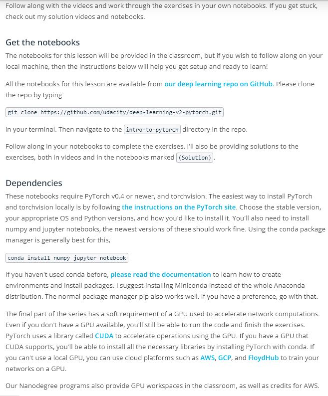
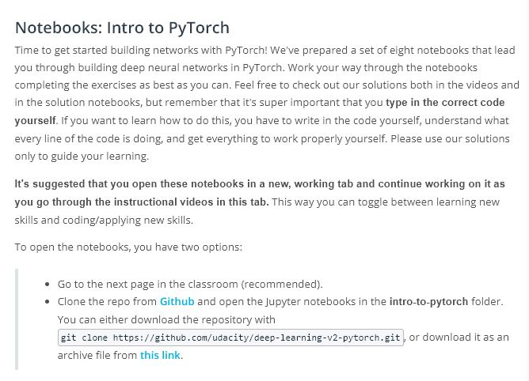
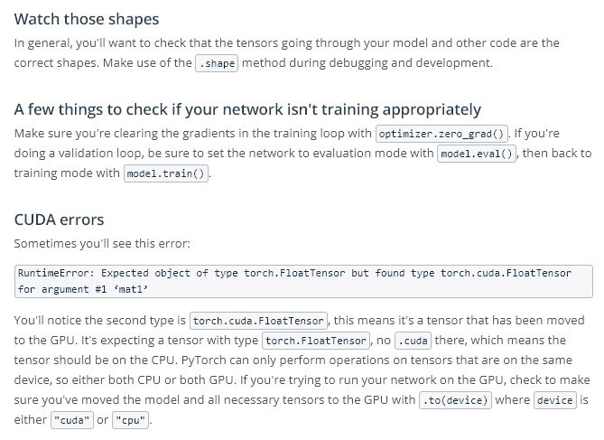

# Lesson 7: Deep Learnig with Pytorch

## Concepts
1. Welcome

1. Pre-Notebook

1. [Single layer neural networks](https://www.youtube.com/watch?v=6Z7WntXays8&feature=emb_logo)
1. [Single layer neural networks solution](https://www.youtube.com/watch?v=mNJ8CujTtpo&feature=emb_logo)
1. [Networks Using Matrix Multiplication](https://www.youtube.com/watch?v=QLaGMz8Ca3E&feature=emb_logo)
1. [Multilayer Networks Solution](https://www.youtube.com/watch?v=iMIo9p5iSbE&feature=emb_logo)
1. [Neural Networks in PyTorch](https://www.youtube.com/watch?v=CSQOdOb2mlg&feature=emb_logo)
1. [Neural Networks Solution](https://www.youtube.com/watch?v=zym36ihtOMY&feature=emb_logo)
1. [Implementing Softmax Solution](https://www.youtube.com/watch?v=8KRX7HvqfP0&feature=emb_logo)
1. [Network Architectures in PyTorch](https://www.youtube.com/watch?v=9ILiZwbi9dA&feature=emb_logo)
1. [Network Architectures Solution](https://www.youtube.com/watch?v=zBWlOeX2sQM&feature=emb_logo)
1. [Training a Network Solution](https://www.youtube.com/watch?v=ExyFG2MjsKs&feature=emb_logo)
1. [Classifying Fashion-MNIST](https://www.youtube.com/watch?v=AEJV_RKZ7VU&feature=emb_logo)
1. [Fashion-MNIST Solution](https://www.youtube.com/watch?v=R6Y4hPLVQWM&feature=emb_logo)
1. [Inference and Validation](https://www.youtube.com/watch?v=XACXlkIdS7Y&feature=emb_logo)
1. [Validation Solution](https://www.youtube.com/watch?v=AjrXltxqsK4&feature=emb_logo)
1. [Dropout Solution](https://www.youtube.com/watch?v=3Py2SbtZLbc&feature=emb_logo)
1. [Saving and Loading Models](https://www.youtube.com/watch?v=psmrPu-mseA&feature=emb_logo)
1. [Loading Image Data](https://www.youtube.com/watch?v=hFu7GTfRWks&feature=emb_logo)
1. [Loading Image Data Solution](https://www.youtube.com/watch?v=d_NhvI1yEf0&feature=emb_logo)
1. [Transfer Learning](https://www.youtube.com/watch?v=S9F7MtJ5jls&feature=emb_logo)
1. [Transfer Learning Solution](https://www.youtube.com/watch?v=4n6T93hKRD4&feature=emb_logo)
1. Tips, Tricks, and Other Notes
