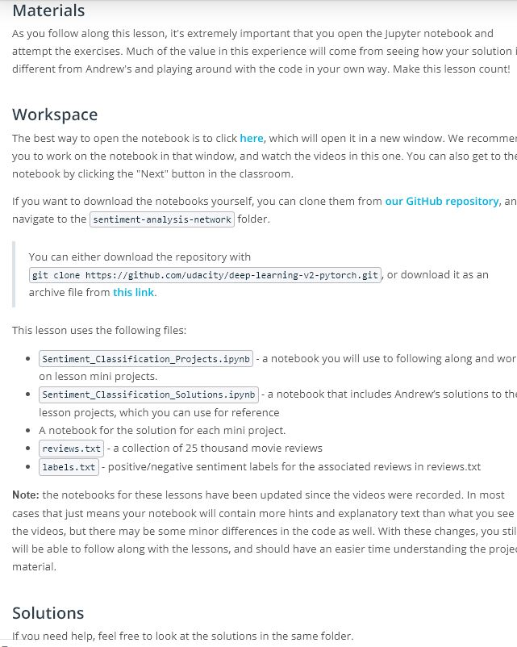
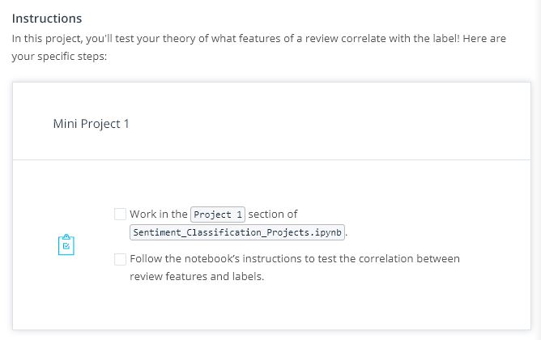
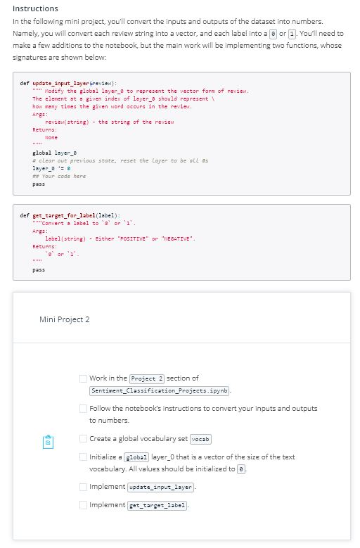
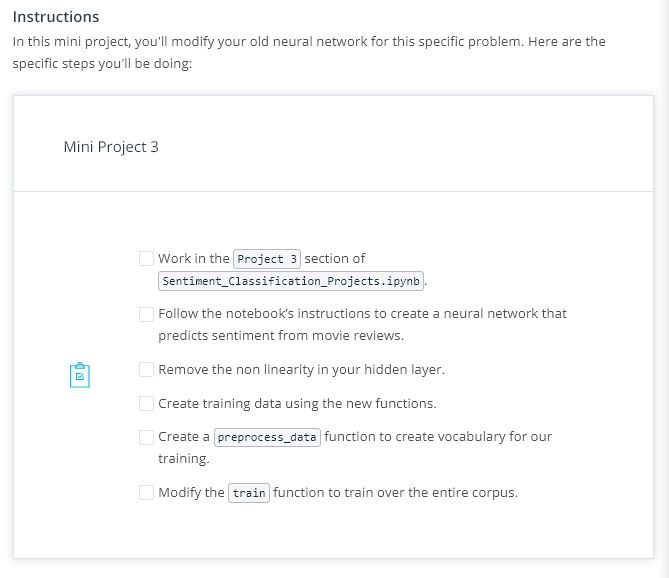
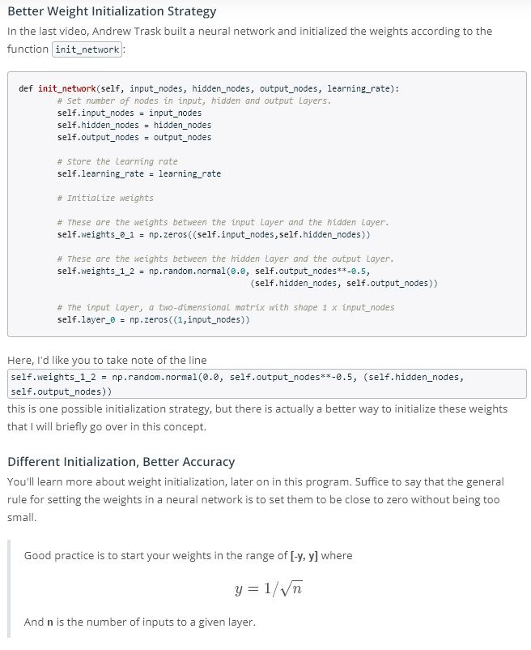
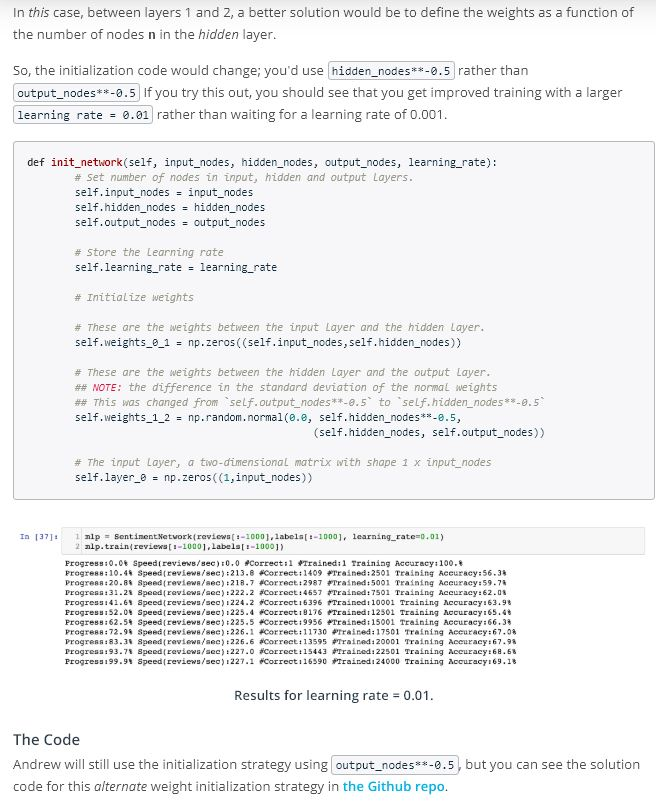
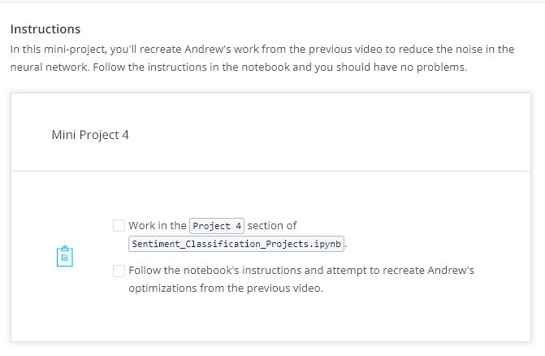
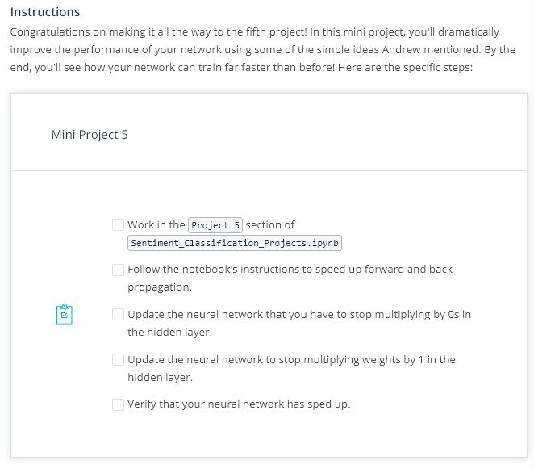
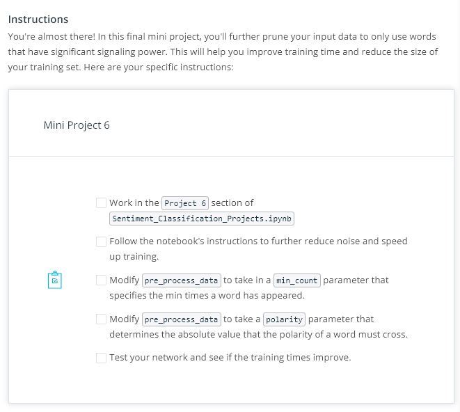

# Lesson 6: Sentiment Analysis

## Concepts
1. [Introducing Andrew Trask](https://www.youtube.com/watch?v=ltO71Bm8b3M&feature=emb_logo)
1. [Meet Andrew](https://www.youtube.com/watch?v=da1I0mea1jQ&feature=emb_logo)
	> For a 40% discount on Andrew's book, use coupon code traskud17.
1. Materials

1. [Framing the Problem](https://www.youtube.com/watch?v=IsTOnkAKaJw&feature=emb_logo)
1. Mini Project 1

1. [Mini Project 1 Solution](https://www.youtube.com/watch?v=l4r5l0HvHRI&feature=emb_logo)
	> Check out the solution in the Project 1 section of Sentiment_Classification_Solutions.ipynb!
1. [Transforming Text into Numbers](https://www.youtube.com/watch?v=7rHBU5cbePE&feature=emb_logo)
1. Mini Project 2

1. [Mini Project 2 Solution](https://www.youtube.com/watch?v=45ihpPaeO8E&feature=emb_logo)
	> Check out the solution in the Project 2 section of Sentiment_Classification_Solutions.ipynb!
1. [Building a Neural Network](https://www.youtube.com/watch?v=aM2k7RTjjJI&feature=emb_logo)
1. Mini Project 3

1. [Mini Project 3 Solution](https://www.youtube.com/watch?v=imnxzCev4SI&feature=emb_logo)
	> Check out the solution in the Project 3 section of Sentiment_Classification_Solutions.ipynb!
1. Better Weight Initialization Strategy

1. [Understanding Neural Noise](https://www.youtube.com/watch?v=ubqhh4Iv7O4&feature=emb_logo)
1. Mini Project 4

1. [Understanding Inefficiencies in our Network](https://www.youtube.com/watch?v=4MuS-6ATxCU&feature=emb_logo)
1. Mini Project 5

1. [Mini Project 5 Solution](https://www.youtube.com/watch?v=Hv86B_jjWTI&feature=emb_logo)
	> Check out the solution in the Project 5 section of Sentiment_Classification_Solutions.ipynb!
1. [Further Noise Reduction](https://www.youtube.com/watch?v=Kl3hWxizKVg&feature=emb_logo)
1. Mini Project 6

1. [Mini Project 6 Solution](https://www.youtube.com/watch?v=ji0famK7gOQ&feature=emb_logo)
	> Check out the solution in the Project 6 section of Sentiment_Classification_Solutions.ipynb!
	> Correction: at 1:30, Andrew says the distribution "centers around one". He meant to say it centers around zero.
1. [Analysis: What's Going on in the Weights?](https://www.youtube.com/watch?v=UHsT35pbpcE&feature=emb_logo)
	> Follow along in your Sentiment_Classification_Projects.ipynb notebook!
1. [Conclusion](https://www.youtube.com/watch?v=nIF0GLOQglQ&feature=emb_logo)