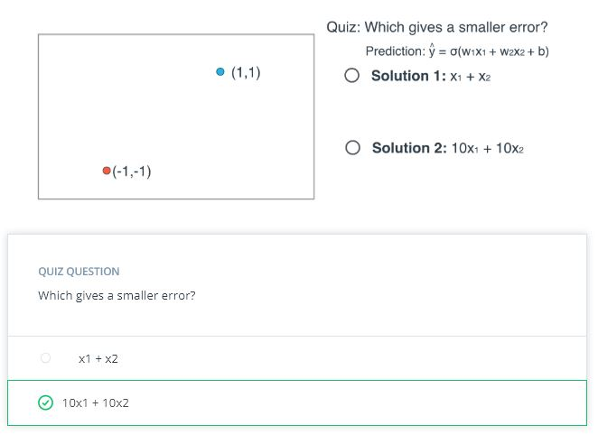

# Lesson 3: Training Neural Networks

## Concepts
1. Instructor: Please say hello to Luis again!
1. [Training Optimization](https://www.youtube.com/watch?v=UiGKhx9pUYc&feature=emb_logo)
1. [Testing](https://www.youtube.com/watch?v=EeBZpb-PSac&feature=emb_logo)
1. [Overfitting and Underfitting](https://www.youtube.com/watch?v=xj4PlXMsN-Y&feature=emb_logo)
1. [Early Stopping](https://www.youtube.com/watch?v=NnS0FJyVcDQ&feature=emb_logo)
1. [Regularization](https://www.youtube.com/watch?v=KxROxcRsHL8&feature=emb_logo)

1. [Regularization 2](https://www.youtube.com/watch?v=ndYnUrx8xvs&feature=emb_logo)
1. [Dropout](https://www.youtube.com/watch?v=Ty6K6YiGdBs&feature=emb_logo)
1. [Local Minima](https://www.youtube.com/watch?v=gF_sW_nY-xw&feature=emb_logo)
1. [Random Restart](https://www.youtube.com/watch?v=idyBBCzXiqg&feature=emb_logo)
1. [Vanishing Gradient](https://www.youtube.com/watch?v=W_JJm_5syFw&feature=emb_logo)
1. [Other Activation Functions](https://www.youtube.com/watch?v=kA-1vUt6cvQ&feature=emb_logo)
	> Correction: For the plots of tanh() and relu() in the first half of the video, the origin should be labeled with a value _y_ = 0, not 0.5.
1. [Batch vs Stochastic Gradient Descent](https://www.youtube.com/watch?v=2p58rVgqsgo&feature=emb_logo)
1. [Learning Rate Decay](https://www.youtube.com/watch?v=TwJ8aSZoh2U&feature=emb_logo)
1. [Momentum](https://www.youtube.com/watch?v=r-rYz_PEWC8&feature=emb_logo)
1. [Error Functions Around the World](https://www.youtube.com/watch?v=34AAcTECu2A&feature=emb_logo)