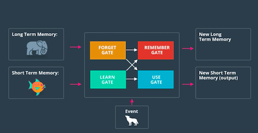
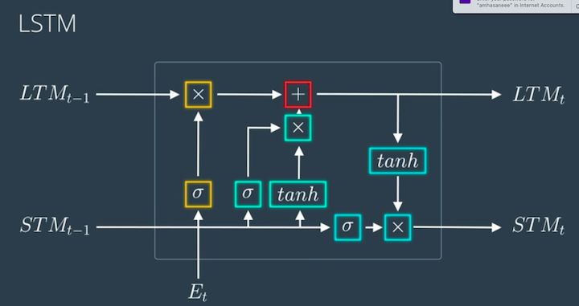
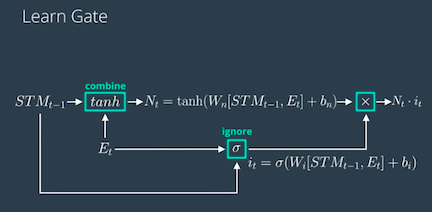
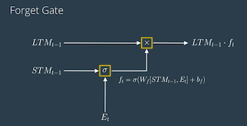
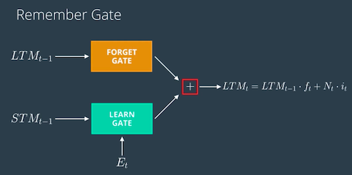
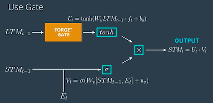

# Long Short Term Memory Networks

## Concepts

1. Intro to LSTM
	1. [Chris Olah's LSTM post](http://colah.github.io/posts/2015-08-Understanding-LSTMs/)
	1. [Edwin Chen's LSTM post](http://blog.echen.me/2017/05/30/exploring-lstms/)
	1. [Andrej Karpathy's lecture](https://www.youtube.com/watch?v=iX5V1WpxxkY) on RNNs and LSTMs from CS231n
	1. [Beginner's guide to LSTM](https://skymind.ai/wiki/lstm)
1. [RNN vs LSTM](Lessons/Lesson2.md): 
	> RNN has a hardtime storing long-term memory due to vanishing gradients. This is where LSTM come to the resque.
1. [Basics of LSTM](Lessons/Lesson3.md)

1. [Architecture of LSTM](Lessons/Lesson4.md)

	1. [The Learn Gate](Lessons/Lesson5.md)
		
	1. [The Forget Gate](Lessons/Lesson6.md)
		
	1. [The Remember Gate](Lessons/Lesson7.md)
		
	1. [The Use Gate](Lessons/Lesson8.md)
		

1. [Putting it All Together](Lessons/Lesson9.md)
1. [Quiz](Lessons/Lesson10.md)
1. [Other architectures](Lessons/Lesson11.md)
	1. Gated Recurrent Unit(GRU) [Lecture](http://www.cs.toronto.edu/~guerzhoy/321/lec/W09/rnn_gated.pdf) 
	1. LSTM with Peephole Connections

