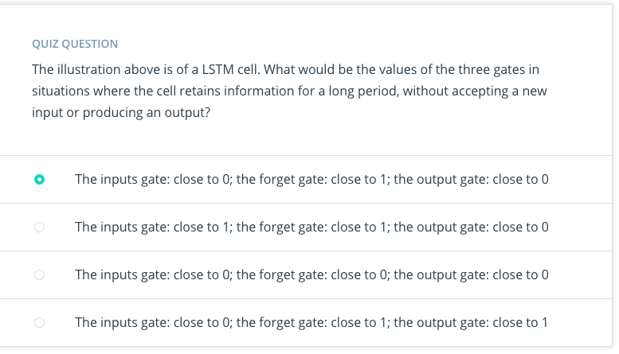

# Long Short Term Memory Networks

## Concepts

1. Intro to LSTM
	1. [Chris Olah's LSTM post](http://colah.github.io/posts/2015-08-Understanding-LSTMs/)
	1. [Edwin Chen's LSTM post](http://blog.echen.me/2017/05/30/exploring-lstms/)
	1. [Andrej Karpathy's lecture](https://www.youtube.com/watch?v=iX5V1WpxxkY) on RNNs and LSTMs from CS231n
	1. [Beginner's guide to LSTM](https://skymind.ai/wiki/lstm)

1. [RNN vs LSTM](Lessons/Lesson2.md): 
	1. 
	1. [youtube link](https://www.youtube.com/watch?v=70MgF-IwAr8)
	> RNN has a hardtime storing long-term memory due to vanishing gradients. This is where LSTM come to the resque.

1. [Basics of LSTM]Lessons/Lesson3.md)
	1. 
	1. [youtube link](https://www.youtube.com/watch?v=gjb68a4XsqE)

1. [Architecture of LSTM]Lessons/Lesson4.md)
	1. 
	1. [youtube link](https://www.youtube.com/watch?time_continue=10&v=ycwthhdx8ws)

1. [The Learn Gate](Lessons/Lesson5.md))
	1. 
	1. [youtube link](https://www.youtube.com/watch?v=aVHVI7ovbHY)

1. [The Forget Gate](Lessons/Lesson6.md))
	1. 
	1. [youtube link](https://www.youtube.com/watch?v=iWxpfxLUPSU)

1. [The Remember Gate](Lessons/Lesson7.md))
	1. 
	1. [youtube link](https://www.youtube.com/watch?time_continue=1&v=0qlm86HaXuU)

1. [The Use Gate](Lessons/Lesson8.md))
	1. 
	1. [youtube link](https://www.youtube.com/watch?v=5Ifolm1jTdY)

1. [Putting it All Together](Lessons/Lesson9.md))
	1. 
	1. [youtube link](https://www.youtube.com/watch?time_continue=1&v=IF8FlKW-Zo0)

1. [Quiz](Lessons/Lesson10.md))
	
	

1. [Other architectures](Lessons/Lesson11.md))
	1. 
	1. [youtube link](https://www.youtube.com/watch?time_continue=7&v=MsxFDuYlTuQ)
	1. [GRU Lecture Note](http://www.cs.toronto.edu/~guerzhoy/321/lec/W09/rnn_gated.pdf)
	1. LSTM with Peephole Connections

